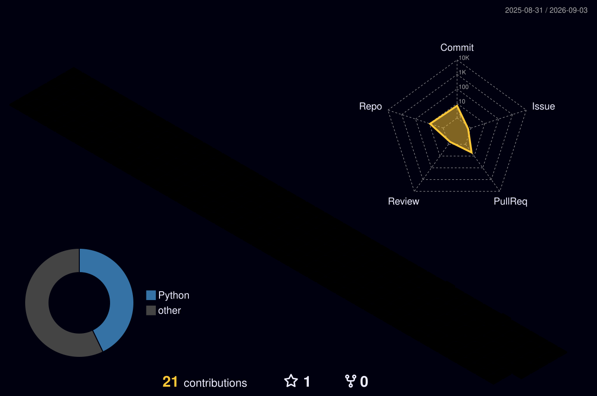

## Hi, I'm yangbosong

**ML infrastructure engineer — making LLMs train and serve efficiently.**

## 🧭 About Me

- 🧪 Infra Intern @ [Mind Lab](https://macaron.im/mindlab) — building managed infrastructure for training and serving millions of LLMs. My work spans high-throughput inference serving, RL post-training systems, and kernel-level optimization.
- 💻 **Python** · **CUDA** · **Triton** · **Rust** — LLM training & inference, serving frameworks, RL infrastructure
- 🔭 Forking & hacking on: [`vllm`](https://github.com/vllm-project/vllm) · [`sglang`](https://github.com/sgl-project/sglang) · [`flash-linear-attention`](https://github.com/sustcsonglin/flash-linear-attention) · [`RL-Kernel`](https://github.com/THUNLP-MT/RL-Kernel) · [`GEAK`](https://github.com/hpcaitech/GEAK)
- 🌐 From serving throughput to training stability — making every token-per-second count.
- 🎮 Also: systems theory, distributed systems, and chasing the next perf bottleneck.

## 🔥 Spirit

  

  

📈 GitHub Stats

  
  

---

<i>“Throughput is a feature.”</i>

